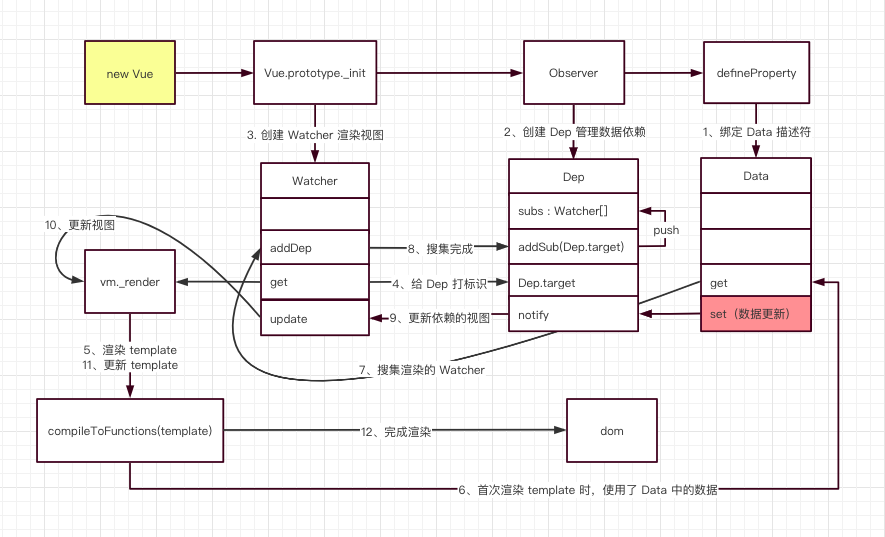
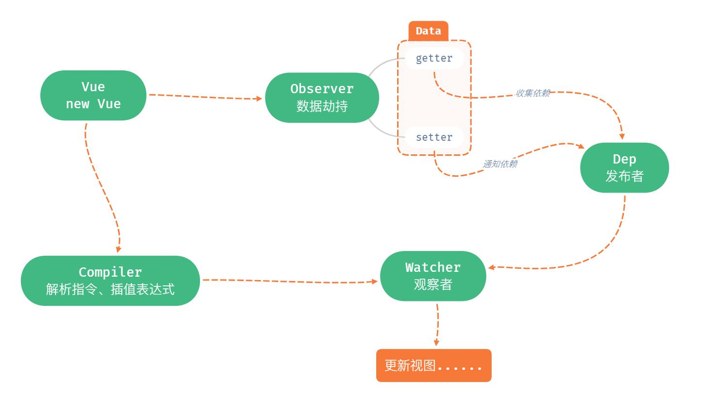
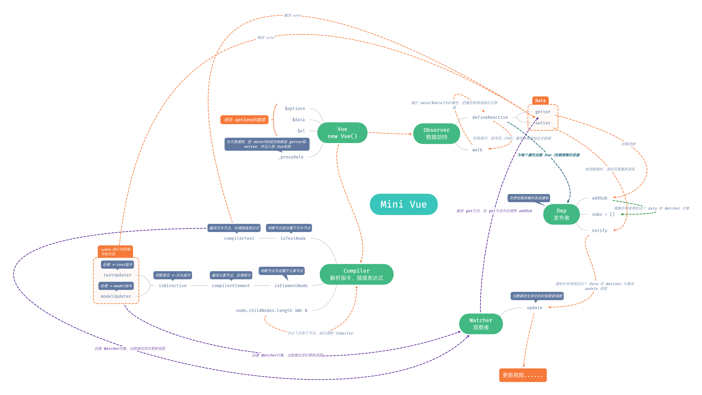
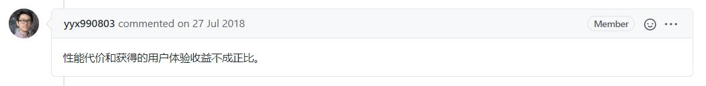

# mini-vue-2

实现一个简单的 Vue.js。用于理解 Vue 响应式原理，妈妈再也不用担心我不会用 Vue 了！

> 技术尚未成熟，只实现小部分功能。 --2020/08/27

## 完整版 Vue 响应式原理

> 图片引自 [孟思行 - 图解 Vue 响应式原理](https://juejin.im/post/6857669921166491662)

## 乞丐版 mini-vue

实现 `mini-vue` 之前，先看看官网的描述。在 `Vue` 官网，[深入响应式原理](https://cn.vuejs.org/v2/guide/reactivity.html)中，是这样说明的：

> 每个组件实例都对应一个 **watcher** 实例，它会在组件渲染的过程中把“接触”过的数据 property 记录为依赖。之后当依赖项的 setter 触发时，会通知 watcher，从而使它关联的组件重新渲染。

### 起步

> TODO 这里没有做 `Virtual DOM`、`render` 部分，而选择直接操作 `DOM`

简单来说，`mini vue` 在创建 `Vue` 实例时

1. `Vue` 类负责把 `data` 中的属性注入到 `Vue` 实例，并调用 `Observer` 类和 `Compiler` 类。
2. `Observer` 类负责数据劫持，把每一个 `data` 转换成 `getter` 和 `setter`。其核心原理是通过 `Object.defineProperty` 实现。
3. `Compiler` 类负责解析指令和插值表达式（更新视图的方法）。
4. `Dep` 类负责收集依赖、添加观察者模式。通知`data` 对应的所有观察者 `Watcher` 来更新视图。在`Observer` 类把每一个 `data` 转换成 `getter` 和 `setter` 时，会创建一个 `Dep` 实例，用来**负责收集依赖并发送通知**。在每一个 `data` 中在 `getter` 中收集依赖。在 `setter` 中通知依赖，既通知所有 `Watcher` 实例新视图。
5. `Watcher` 类负责数据更新后，使关联视图重新渲染。

**实现代码都添加了详细的注释，无毒无害，可放心查看**

### 最后

#### 完整版思维导图

## FAQ

### 对于数组的监听

这里直接把数组的每一项都添加上了 `getter` 和 `setter`，所以 `vm.items[1] = 'x'` 也是响应式的。

`Vue` 中为什么没这样做呢？参考 [为什么vue没有提供对数组属性的监听？](https://github.com/vuejs/vue/issues/8562)

